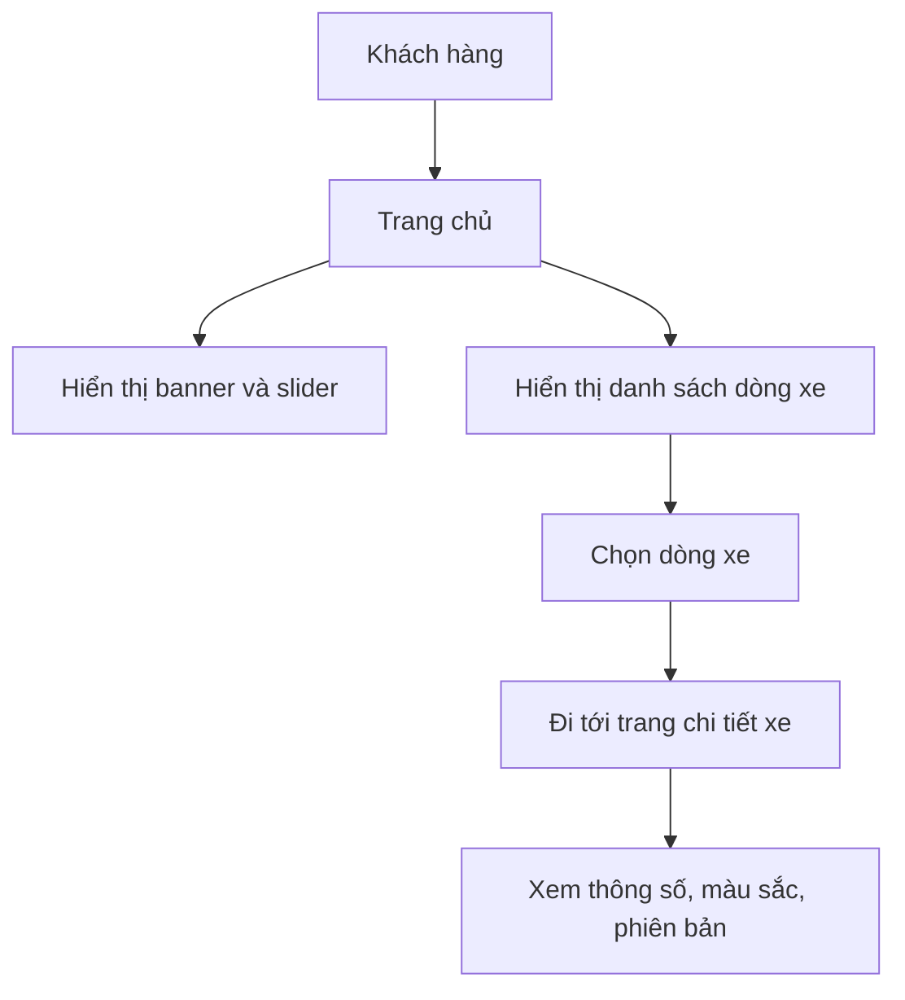
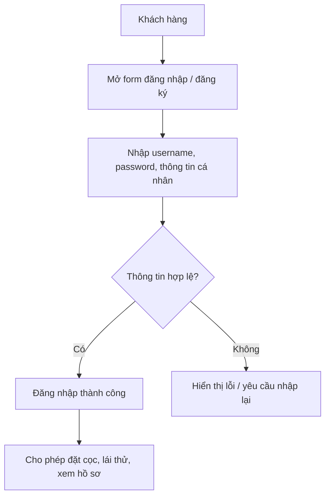
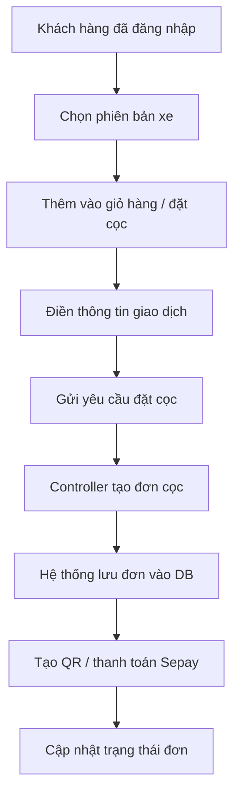
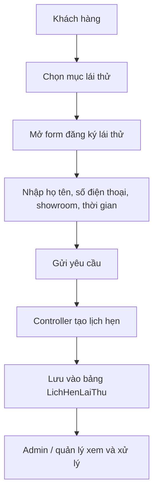
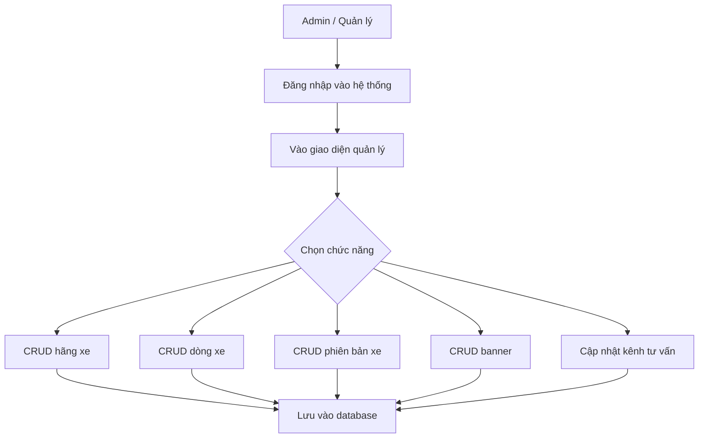
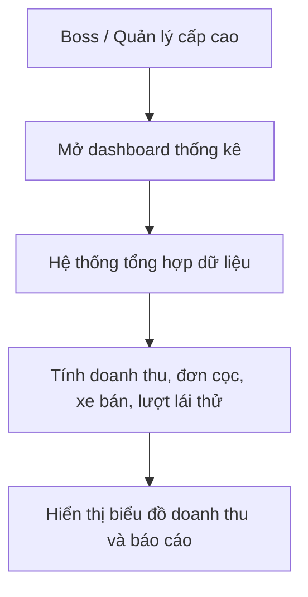
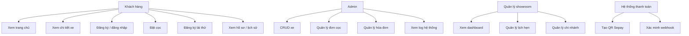

# Thống kê luồng nghiệp vụ, use case và biểu đồ lớp – MyLxCar

> Bản này được viết theo phong cách code, dễ copy vào báo cáo hoặc dùng để trao đổi với nhóm phát triển.

---

## 1. Luồng nghiệp vụ chính

### 1.1 Luồng xem trang chủ và chọn xe


### 1.2 Luồng đăng nhập / đăng ký


### 1.3 Luồng đặt cọc


### 1.4 Luồng đăng ký lái thử


### 1.5 Luồng quản trị CRUD xe và nội dung


### 1.6 Luồng thống kê doanh thu cho boss


---

## 2. Use case theo kiểu code



---

## 3. Biểu đồ lớp theo kiểu code (phiên bản dễ đọc)

```text
classDiagram
    %% =========================
    %% 1. VIEW LAYER
    %% =========================
    class TrangChuView {
        +hienThiBanner(List banners)
        +hienThiDanhSachDongXe(List dongXe)
        +hienThiKenhTuVan(KenhTuVanModel kenh)
    }

    class TrangChiTietXeView {
        +hienThiThongSoKyThuat(PhienBanXeModel xe)
        +hienThiCacPhienBan(List phienBan)
        +hienThiNutDatCoc()
        +hienThiNutDangKyLaiThu()
    }

    class FormDangNhapDangKyView {
        +hienThiFormDangNhap()
        +hienThiFormDangKy()
        +layThongTinNhap() Map
    }

    class FormDatCocView {
        +hienThiThongTinXe(PhienBanXeModel xe)
        +nhapThongTinGiaoDich() Form
        +xacNhanDatCoc()
    }

    class FormDangKyLaiThuView {
        +nhapThongTinKhachLai() Form
        +chonChiNhanh(List showroom)
        +guiYeuCau()
    }

    class GiaoDienQuanLy {
        +hienThiDanhSachDonHang(List donHang)
        +hienThiFormXuatHoaDon()
        +hienThiFormCRUDXe()
        +hienThiFormBanner()
        +hienThiFormTuVan()
    }

    class GiaoDienDashboardBoss {
        +hienThiBieuDoDoanhThu(ThongKeTongHopModel data)
    }

    %% =========================
    %% 2. CONTROLLER LAYER
    %% =========================
    class TaiKhoanController {
        +dangNhap(string u, string p) bool
        +dangKyKhachHang(string u, string p, string hoTen, string sdt) bool
        +kiemTraDangNhap() bool
    }

    class SanPhamController {
        +layDanhSachDongXeTrangChu() List
        +layChiTietPhienBan(int maDong) List
        +layBannerTrangChu() List
        +layKenhTuVan() KenhTuVanModel
    }

    class GiaoDichController {
        +moFormDatCoc(int maPhienBan)
        +moFormLaiThu(int maDong)
        +taoDonDatCoc(int maKhachHang, int maPhienBan, decimal soTienCoc) bool
        +duyetDonDatCoc(int maDonCoc, int maQuanLy) bool
        +xuatHoaDonMuaXe(int maDonCoc) bool
        +datLichHenLaiThu(int maKhachHang, int maDong, string maChiNhanh) bool
    }

    class HeThongController {
        +themBanner(string path, string link, int maAdmin) bool
        +suaBanner(int maBanner, string path, string link) bool
        +xoaBanner(int maBanner) bool
        +capNhatKenhTuVan(int maKenh, string mes, string zalo, string sms) bool
        +themHangXe(string tenHang, string quocGia, string logo) bool
        +suaHangXe(int maHang, string tenHang, string quocGia, string logo) bool
        +xoaHangXe(int maHang) bool
        +themDongXe(int maHang, string tenDong, string kieuDang) bool
        +suaDongXe(int maDong, int maHang, string tenDong, string kieuDang) bool
        +xoaDongXe(int maDong) bool
        +themPhienBanXe(Map data) bool
        +suaPhienBanXe(int maPhienBan, Map data) bool
        +xoaPhienBanXe(int maPhienBan) bool
        +tongHopThongKe(string kyBaoCao) ThongKeTongHopModel
    }

    %% =========================
    %% 3. MODEL LAYER
    %% =========================
    class TaiKhoanModel {
        +int MaTaiKhoan
        +string TenDangNhap
        +string MatKhau
        +string VaiTro
        +string TrangThai
        +insert() bool
        +checkCredentials() bool
    }

    class ChiTietKhachHangModel {
        +int MaKhachHang
        +string HoTen
        +string SoDienThoai
        +string DiaChi
        +date NgaySinh
    }

    class HangXeModel {
        +int MaHang
        +string TenHang
        +string QuocGia
        +string DuongDanLogo
        +getAll() List
        +insert() bool
        +update() bool
        +delete() bool
    }

    class DongXeModel {
        +int MaDong
        +int MaHang
        +string TenDong
        +string KieuDang
        +getAll() List
        +insert() bool
        +update() bool
        +delete() bool
    }

    class PhienBanXeModel {
        +int MaPhienBan
        +int MaDong
        +string TenPhienBan
        +bigint GiaNiemYet
        +string MauSac
        +string DongCo
        +string HopSo
        +string LoaiNhietLieu
        +int SoLuongTrongKho
        +string DuongDanAnh
        +string MaKhuyenMai
        +string TrangThai
        +getById(int id)
        +insert() bool
        +update() bool
        +delete() bool
    }

    class DonDatCocModel {
        +int MaDonCoc
        +int MaKhachHang
        +int MaPhienBan
        +int MaQuanLyDuyet
        +decimal SoTienCoc
        +string TrangThaiDonHang
        +string TrangThaiThanhToan
        +datetime NgayTaoDon
        +insert() bool
    }

    class HoaDonMuaXeModel {
        +string MaHoaDon
        +int MaDonCoc
        +int MaKhachHang
        +int MaPhienBan
        +bigint TongTienPhaiTra
        +datetime NgayXuatHoaDon
        +string TrangThaiHoaDon
        +insert() bool
    }

    class LichHenLaiThuModel {
        +int MaLichHen
        +int MaKhachHang
        +int MaDong
        +string MaChiNhanh
        +string HoTenNguoiLai
        +string SoDienThoai
        +string SoBangLaiXe
        +date NgayHen
        +string GioHen
        +string TrangThai
        +insert() bool
    }

    class ChiNhanhShowroomModel {
        +string MaChiNhanh
        +string TenChiNhanh
        +string DiaChi
        +string ThanhPho
        +string DuongDayNong
        +int MaQuanLy
        +string TrangThai
        +getAll() List
    }

    class ChuongTrinhKhuyenMaiModel {
        +string MaKhuyenMai
        +string TieuDe
        +string MoTa
        +decimal GiaTriGiam
        +datetime NgayBatDau
        +datetime NgayKetThuc
        +string TrangThai
    }

    class QuangCaoBannerModel {
        +int MaBanner
        +string DuongDanAnh
        +string DuongDanLienKet
        +int ThuTuHienThi
        +int MaQuanLyCapNhat
        +bool TrangThaiKichHoat
        +insert() bool
        +update() bool
        +delete() bool
        +getActive() List
    }

    class KenhTuVanModel {
        +int MaKenh
        +string UrlMessenger
        +string UrlZalo
        +string UrlSMS
        +updateLinks() bool
        +getLinks() KenhTuVanModel
    }

    class ThongKeTongHopModel {
        +int MaThongKe
        +string KyBaoCao
        +string MaChiNhanh
        +bigint TongDoanhThu
        +bigint TongTienCocThuVe
        +int TongSoXeDaBan
        +int SoDonCocBiHuy
        +int TongLuotXemWeb
        +int TongLuotLaiThu
        +int MaDongXeBanChayNhat
        +getReport(string ky) ThongKeTongHopModel
    }

    %% =========================
    %% 4. RELATIONSHIP
    %% =========================
    TrangChuView --> SanPhamController
    TrangChiTietXeView --> SanPhamController
    FormDangNhapDangKyView --> TaiKhoanController
    FormDatCocView --> GiaoDichController
    FormDangKyLaiThuView --> GiaoDichController
    GiaoDienQuanLy --> GiaoDichController
    GiaoDienQuanLy --> HeThongController
    GiaoDienDashboardBoss --> HeThongController

    SanPhamController --> HangXeModel
    SanPhamController --> DongXeModel
    SanPhamController --> PhienBanXeModel
    SanPhamController --> QuangCaoBannerModel
    SanPhamController --> KenhTuVanModel

    GiaoDichController --> DonDatCocModel
    GiaoDichController --> HoaDonMuaXeModel
    GiaoDichController --> LichHenLaiThuModel
    GiaoDichController --> ChiNhanhShowroomModel
    GiaoDichController --> ChuongTrinhKhuyenMaiModel

    HeThongController --> HangXeModel
    HeThongController --> DongXeModel
    HeThongController --> PhienBanXeModel
    HeThongController --> QuangCaoBannerModel
    HeThongController --> KenhTuVanModel
    HeThongController --> ThongKeTongHopModel

    TaiKhoanController --> TaiKhoanModel
    TaiKhoanController --> ChiTietKhachHangModel
```

---

## 4. Mapping giữa module hiện tại và lớp trong code

```text
Trang chủ            -> Pages/Index.cshtml.cs
Chi tiết xe          -> Pages/Details.cshtml.cs
Đăng nhập / đăng ký  -> Pages/Account/*
Đặt cọc             -> Pages/Orders/Cart/*
Lái thử             -> Pages/TestDrive.cshtml.cs
Quản lý xe          -> Pages/Admin/*
Dashboard boss      -> Pages/Admin/ThongKe/*
```

---

## 5. Ghi chú để mở rộng thêm chức năng

```text
Khi phát triển thêm chức năng, nên bổ sung các lớp sau:
- PaymentService
- NotificationService
- ReviewService
- WishlistService
- InventoryService
- AuditLogService
```
